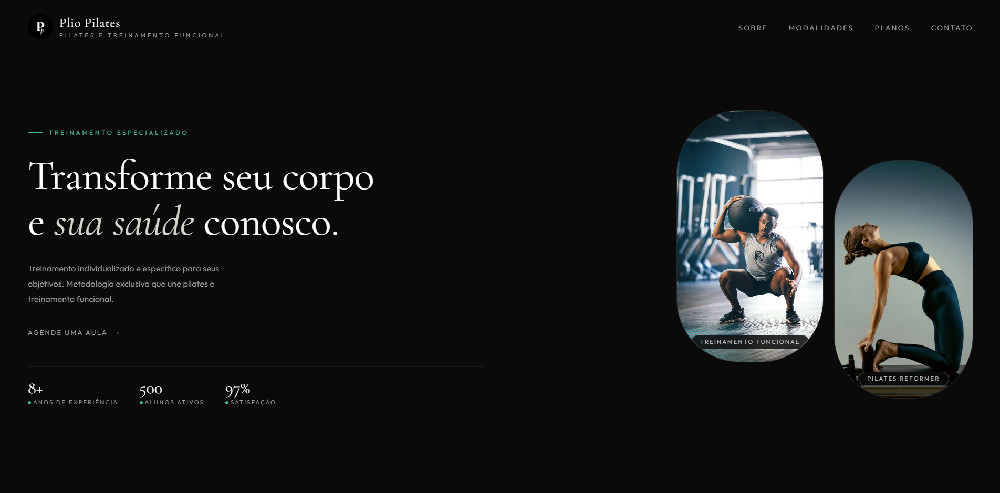
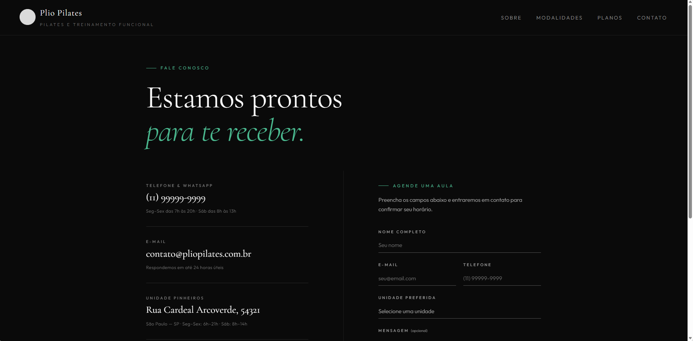

# Pulse Pilates


Sistema web institucional para uma clínica de pilates e treinamento funcional, desenvolvido com foco em experiência do usuário, design moderno e integração com banco de dados em nuvem.

## Preview




---

# Funcionalidades

* Landing page institucional
* Navegação entre páginas
* Formulário de agendamento funcional
* Integração com banco de dados PostgreSQL
* Armazenamento em nuvem com Supabase
* Máscara automática para telefone
* Validação de formulário
* Restrição de um agendamento por e-mail
* Feedback visual moderno com SweetAlert2
* Layout responsivo

---

# Tecnologias utilizadas

## Frontend

* HTML5
* CSS3
* JavaScript

## Backend / Serviços

* Supabase
* PostgreSQL

## Bibliotecas

* Supabase JS
* IMask.js
* SweetAlert2

---

# Estrutura do projeto

```txt
Pulse_Pilates/
│
├── assets/
│   ├── css/
│   ├── img/
│   └── js/
│
├── pages/
│
├── index.html
└── README.md
```

---

# Banco de dados

O projeto utiliza PostgreSQL hospedado no Supabase.

Tabela principal:

```sql
CREATE TABLE agendamentos (
  id BIGINT PRIMARY KEY GENERATED ALWAYS AS IDENTITY,
  nome TEXT NOT NULL,
  email TEXT NOT NULL UNIQUE,
  telefone TEXT NOT NULL,
  unidade TEXT NOT NULL,
  mensagem TEXT,
  criado_em TIMESTAMP DEFAULT NOW()
);
```

---

# Segurança implementada

* Row Level Security (RLS)
* Restrição de leitura pública
* Permissão apenas para INSERT
* Normalização de e-mail
* Remoção de máscara do telefone antes do armazenamento
* HTTPS via Supabase

---

# Como executar o projeto

## 1. Clone o repositório

```bash
git clone https://github.com/seu-usuario/Pulse_Pilates.git
```

---

## 2. Abra o projeto

Recomendado:

* VS Code
* GitHub Codespaces
* Live Server

---

## 3. Configure o Supabase

Crie um projeto no Supabase e adicione:

```js
const supabaseUrl = 'SUA_URL';
const supabaseKey = 'SUA_CHAVE_PUBLICA';
```

no arquivo:

```txt
assets/js/agendamento.js
```

---

## 4. Execute localmente

Utilize uma extensão como Live Server para iniciar o projeto.

---

# Melhorias futuras

* Painel administrativo
* Login de administrador
* Dashboard de métricas
* Integração com WhatsApp
* Sistema de confirmação automática
* Calendário de horários
* Deploy em domínio próprio

---

# Objetivo do projeto

Este projeto foi desenvolvido com fins acadêmicos e de portfólio, visando praticar:

* desenvolvimento frontend
* integração com APIs
* persistência de dados
* arquitetura web moderna
* experiência do usuário
* boas práticas de organização e segurança

---

# Autor

Desenvolvido por Giovani Freire.
